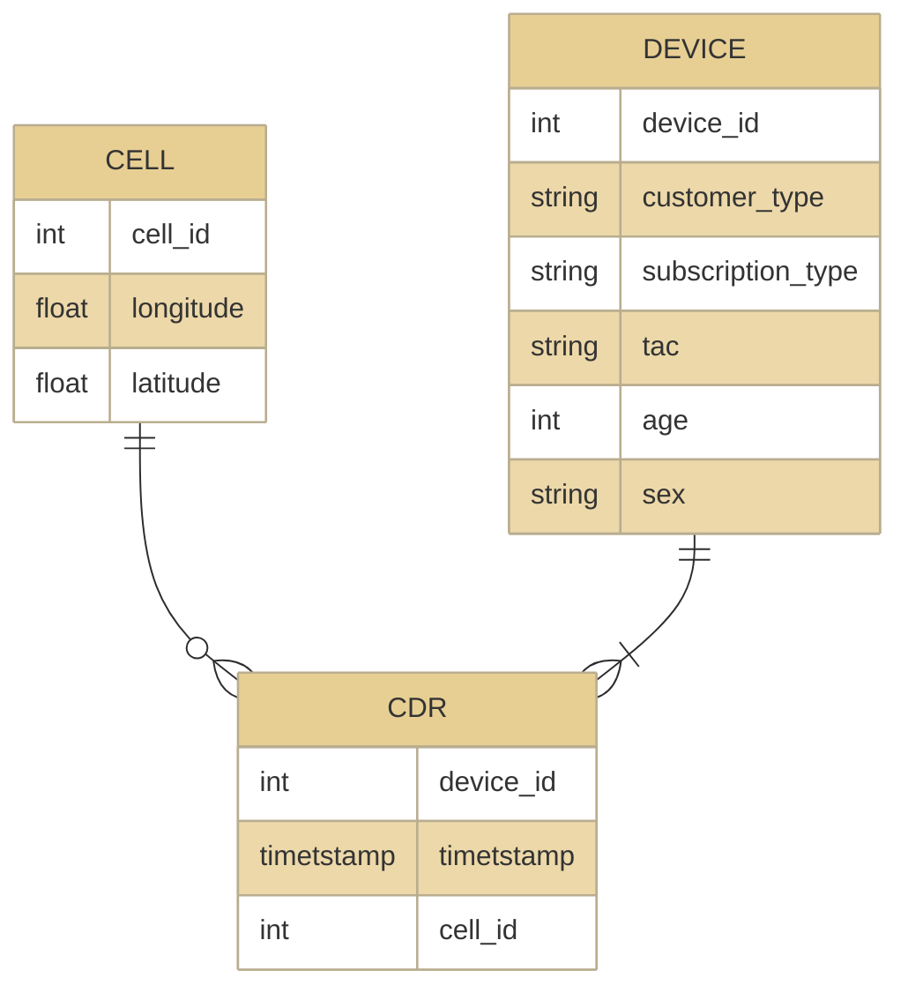

# Code repository for paper "Commuting Analysis of the Budapest Metropolitan Area using Mobile Network Data"

The mobile network data used in the study are not publicly available due to third-party restrictions. So, to make the scripts executeable, dummy CDR data is generated by a (pseudo)random generator.

The daily activity record distribution is mimicked by the real distribution of CDR activity through a day, and some dummy devices has more activity records via a lognormal distribution. Furthermore, two cells are selected with higher probability for every device, but the spatial distribution of the activity does not represent the real distribution.
The results of these scripts executed over the dummy data cannot be considered valid and compareable to the published results in any way.
The sole purpose of the dummy data is to make the scripts executable.

## What is included?

- Home and workplace detection scripts
- plotting scripts

## Generate Dummy Data

The `dummy_data/generate.py` script generates the following schema (Figure 6) in CSV format.

## Activity Statistics Notebook

- Plots Figure 2 and 3 from the dummy data.

## Merge Cells Notebook

- Demonstrate the cell merging using DBSCAN algorithm
- Plot Figure 5

## Home-Work Notebook

- Plot Figure 7, 9, 10, 12, 13, 14

## Software Requirements

- Python 3.10.5
- Pandas 1.4.2
- GeoPandas 0.11.0
- numpy 1.22.4
- matplotlib 3.5.2
- Seaborn 0.11.2
- matplotlib_scalebar 0.8.1
- osmnx 1.1.2
- sqlite3 3.38.5
- geovoronoi 0.4.0
- wcag_contrast_ratio 0.9

N.B.: The displayed versions are not the minimum requirement, but the versions used in the study and in the notebooks.

## License

- The code -- scripts and queries -- is licensed under MIT.
- The documentation and figures are [CC BY 4.0](https://creativecommons.org/licenses/by/4.0/)
- `input/216.csv` is downloaded from https://opencellid.org and governed by [Attribution-ShareAlike 4.0 International (CC BY-SA 4.0)](https://creativecommons.org/licenses/by-sa/4.0/)
- The shape files (`agglomeration_border.geojson`, `budapest_border.geojson`, and `cities_with_labels.geojson`) is from OpenStreetMap and licensed under the Open Data Commons Open Database License (ODbL)

## Cite

## References

- https://www.openstreetmap.org
    - OpenStreetMap is open data, licensed under the Open Data Commons Open Database License (ODbL) by the OpenStreetMap Foundation (OSMF).
- https://opencellid.org
    - open mobile cell data
- MCC MNC list from https://cellidfinder.com/mcc-mnc
    - |mcc|mnc|operator                  |brandname|
      |--:|--:|:-------------------------|:--------|
      |216| 70|Vodafone Magyarország Zrt.|Vodafone |
