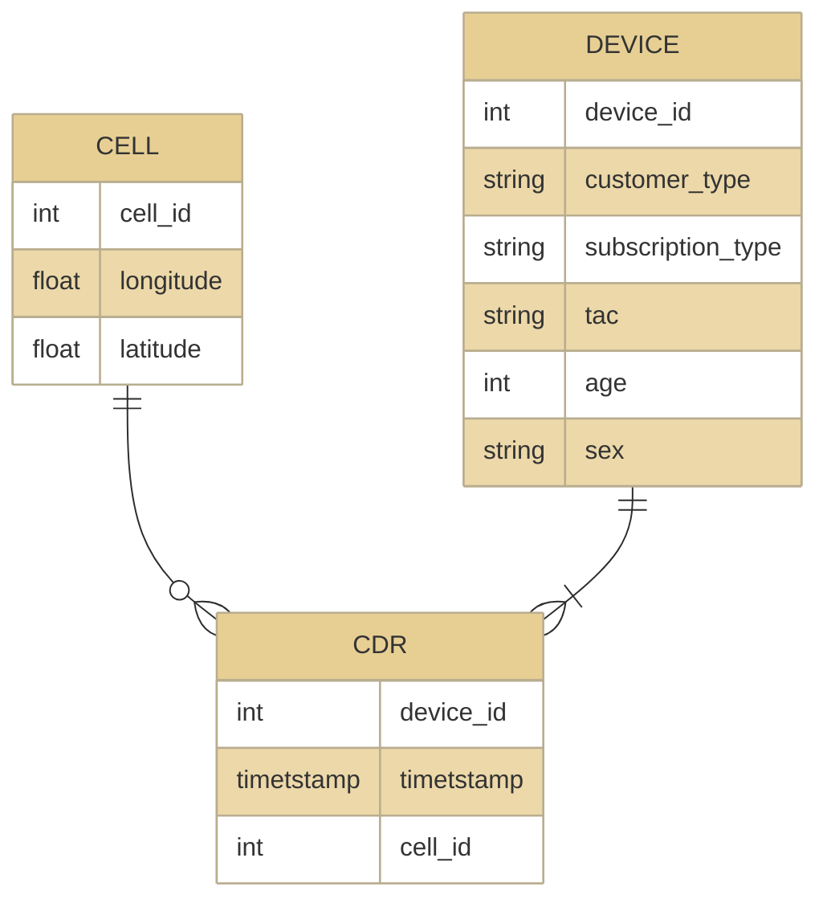

# Code repository for paper "Commuting Analysis of the Budapest Metropolitan Area using Mobile Network Data"

ISPRS International Journal of Geo-Information. 2022, 11(9); August 29, 2022; 

  
Abstract

  The analysis of human movement patterns based on mobile network data makes it possible to examine a very large population cost-effectively and has led to several discoveries about human dynamics. However, the application of this data source is still not common practice. The goal of this study was to analyze the commuting tendencies of the Budapest Metropolitan Area using mobile network data as a case study and propose an automatized alternative approach to the current, questionnaire-based method, as commuting is predominantly analyzed by the census, which is performed only once in a decade in Hungary. To analyze commuting, the home and work locations of cell phone subscribers were determined based on their appearances during and outside working hours. The detected home locations of the subscribers were compared to census data at a settlement level. Then, the settlement and district level commuting tendencies were identified and compared to the findings of census-based sociological studies. It was found that the commuting analysis based on mobile network data strongly correlated with the census-based findings, even though home and work locations were estimated by statistical methods. All the examined aspects, including commuting from sectors of the agglomeration to the districts of Budapest and the age-group-based distribution of the commuters, showed that mobile network data could be an automatized, fast, cost-effective, and relatively accurate way of analyzing commuting, that could provide a powerful tool for sociologists interested in commuting.

The mobile network data used in the study are not publicly available due to third-party restrictions. So, to make the scripts executable, dummy CDR data is generated by a (pseudo)random generator.

The daily activity record distribution is mimicked by the real distribution of CDR activity through a day, and some dummy devices has more activity records via a lognormal distribution. Furthermore, two cells are selected with higher probability for every device, but the spatial distribution of the activity does not represent the real distribution.
The results of these scripts executed over the dummy data cannot be considered valid and comparable to the published results in any way.
The sole purpose of the dummy data is to make the scripts executable.

## What is included?

- Home and workplace detection scripts
- plotting scripts

## Generate Dummy Data

The `dummy_data/generate.py` script generates the following schema (Figure 6) in CSV format.

## Activity Statistics Notebook

- Plots Figure 2 and 3 from the dummy data.

## Merge Cells Notebook

- Demonstrate the cell merging using DBSCAN algorithm
- Plot Figure 6

## Home-Work Notebook

- Plot Figure 8, 10, 11, 13, 14, 15

## Software Requirements

- Python 3.10.5
- Pandas 1.4.2
- GeoPandas 0.11.0
- numpy 1.22.4
- matplotlib 3.5.2
- Seaborn 0.11.2
- matplotlib_scalebar 0.8.1
- osmnx 1.1.2
- sqlite3 3.38.5
- geovoronoi 0.4.0
- wcag_contrast_ratio 0.9

N.B.: The displayed versions are not the minimum requirement, but the versions used in the study and in the notebooks.

## License

- The code -- scripts and queries -- is licensed under MIT.
- The documentation and figures are [CC BY 4.0](https://creativecommons.org/licenses/by/4.0/)
- `input/216.csv` is downloaded from https://opencellid.org and governed by [Attribution-ShareAlike 4.0 International (CC BY-SA 4.0)](https://creativecommons.org/licenses/by-sa/4.0/)
- The shape files (`agglomeration_border.geojson`, `budapest_border.geojson`, and `cities_with_labels.geojson`) is from OpenStreetMap and licensed under the Open Data Commons Open Database License (ODbL)

## Cite

## References

- https://www.openstreetmap.org
    - OpenStreetMap is open data, licensed under the Open Data Commons Open Database License (ODbL) by the OpenStreetMap Foundation (OSMF).
- https://opencellid.org
    - open mobile cell data
- MCC MNC list from https://cellidfinder.com/mcc-mnc
    - |mcc|mnc|operator                  |brandname|
      |--:|--:|:-------------------------|:--------|
      |216| 70|Vodafone Magyarország Zrt.|Vodafone |
